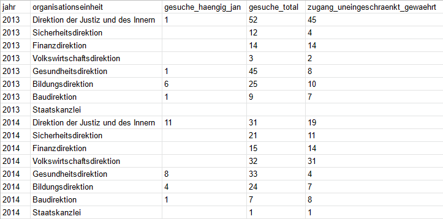

Version, Datum: **v1.1, 2022-06-19** <br>
Status: **in Kraft** <br>
Verwalterin: **[Fachausschuss Open Government Data des Kantons Zürich](https://www.zh.ch/de/direktion-der-justiz-und-des-innern/statistisches-amt/open-government-data/fachausschuss-open-government-data.html#910522844)**

> **Feedback (Hinweise, Wünsche und Fragen)** bitte [als Issue erfassen](https://github.com/openZH/mdd-ogd-handbook/issues) oder per E-Mail senden an: info@open.zh.ch


# Leitlinien des Kantons Zürich für einfach nutzbare Behördendaten

Handlungsleitende Normen, um offene Behördendaten ('Open Government Data', OGD) bereitzustellen, die einfach nutzbar sind:
- [Daten-Formate](#daten-formate)
- [Daten-Strukturen](#daten-strukturen)
- [Metadaten](#metadaten)

## Daten-Formate

### Grundsatz
Offene Daten stehen in einem nicht-proprietären, [offenen Format](http://opendatahandbook.org/glossary/en/terms/open-format/) zur Verfügung.

### Vorgaben
Für tabellarische Daten verwenden wir das Format [CSV](http://opendatahandbook.org/glossary/en/terms/csv/) (**nicht** XLS) mit UTF-8 Codierung. <br>

Variabeln und Werte trennen wir mittels Kommata `,` (**nicht** mittels Semikolons `;`) voneinander ab.
- [So erstelle ich aus einer XLS-Datei ein CSV.](https://github.com/openZH/mdd-ogd-handbook/blob/main/publikationsleitlinien/xls-zu-csv-konvertieren.md)
- [So speichere ich ein CSV als Unicode (UTF-8) ab.](https://github.com/openZH/mdd-ogd-handbook/blob/main/publikationsleitlinien/UTF-8-kodieren.md)

### Empfehlungen
Für Daten mit komplexen Strukturen oder um Daten einfach zwischen Programmen und Systemen zu übertragen, eignen sich die Formate [JSON](http://opendatahandbook.org/glossary/en/terms/json/) sehr und [XML](http://opendatahandbook.org/glossary/en/terms/xml/) gut.

## Daten-Strukturen

### Grundsatz
Offene Daten stehen als [strukturierte Daten](http://opendatahandbook.org/glossary/en/terms/structured-data/) zur Verfügung (**nicht** als Word, PDF oder Fliesstext).

### Vorgaben
Tabellarische Daten im Format CSV strukturieren wir gemäss dem Prinzip ['Tidy Data'](https://github.com/openZH/mdd-ogd-handbook/blob/main/publikationsleitlinien/warum_tidy_data.md). <br>

Das heisst: [pro Variable eine Spalte](#pro-variable-eine-spalte), [pro Beobachtung eine Zeile](#pro-beobachtung-eine-zeile) und [pro Wert eine Zelle](#pro-wert-eine-zelle). <br>

[Beispiel](https://www.zh.ch/de/politik-staat/opendata.html?keyword=ogd#/details/523@fachstelle-ogd-kanton-zuerich): <br>


#### Pro Variable eine Spalte
Keine Spalten-Hierarchien, also keine miteinander zusammengeführten Zellen (z.B. um Ober- und Unterkategorien zu repräsentieren), sondern Oberkategorien in einer ersten Spalte, Unterkategorien in einer zweiten Spalte. <br>

Spaltenüberschriften (Variabeln):
- beginnen nicht mit einer Zahl,
- haben keine Leerzeichen, sondern sind entweder zusammengeschrieben (Gross- und Kleinbuchstaben sind möglich) oder besser mittels 'Underscore' verbunden (z.B. `gesuche_total`),
- haben keine Umlaute, sondern sind ausgeschrieben als `ae`, `oe`, `ue` und
- haben keine Sonderzeichen, sondern sind ausgeschrieben (z.B. `prozent` statt `%`).
```
jahr,organisationseinheit,gesuche_haengig_jan,gesuche_total,zugang_uneingeschraenkt_gewaehrt
2013,Direktion der Justiz und des Innern,1,52,45
2014,Direktion der Justiz und des Innern,11,31,19
...
```
Wir verzichten auf überflüssige Variablen (z.B. mit denselben Wert über die gesamte Reihe). Die Anzahl Variablen ist nicht beschränkt. Dabei spielt es keine Rolle, wenn man in der Fensteransicht nicht mehr alle Variablen auf einmal sieht. <br>

#### Pro Beobachtung eine Zeile
- Keine Leerzeilen.
- Keine Fussnoten und ähnliche Verweise. Hinweise vermitteln wir:
   - entweder in einer eigenen Spalte oder
   - (wenn kurz) in der Metadaten-Beschreibung der entsprechenden Daten-Ressource oder
   - (wenn ausführlicher) als HTML-Page, TXT- oder PDF-Datei, die wir in den Metadaten unter "Weitere Informationen" referenzieren.

#### Pro Wert eine Zelle
Alle Zellen einer Spalte haben dasselbe Daten-Format. Die häufigsten sind: 
1. `Text`
2. `Zahl`
3. `Datum`
4. `Uhrzeit`
5. `URL`.

Einheitsangaben dürfen nicht zusammen mit Werten in derselben Zelle stehen. <br>

##### 1. Text 
Werte mit Daten-Format `Text`, die Kommas enthalten, klammern wir zwingend mittels Anführungs- und Schlusszeichen ein (z.B. `"Französisch, Deutsch"`). Das ist wichtig, damit diese Text-Inhalte (in der Fachsprache bezeichnet als `String` bzw. Zeichenkette) trotz Leerzeichen oder Kommas als zusammengehörend interpretiert werden. <br>

##### 2. Zahl 
Werte mit Daten-Format `Zahl` formatieren wir einheitlich ohne Hochkommas, Leerzeichen oder andere 1000er-Trennzeichen.
- Als Dezimaltrennzeichen verwenden wir einen Punkt.
- Ob man rundet oder nicht, kommt auf den Datensatz und seine Nutzung an. Falls gerundet wird, muss dies aber in den Metadaten deklariert werden.

##### 3. Datum 
Werte mit Daten-Format `Datum` geben wir nicht als Zeichenketten (z.B. `24. Dez. 2021`) an, sondern verwenden den [internationalen Standard ISO 8601](https://www.w3.org/TR/NOTE-datetime): `YYYY-MM-DD` (z.B. `2021-12-24`). <br>

##### 4. Uhrzeit 
Werte mit Daten-Format `Uhrzeit` geben wir dem [internationalen Standard ISO 8601](https://www.w3.org/TR/NOTE-datetime) gemäss an als `hh:mm:ss`. Wir verwenden die Zeitzone `UTC+1`: `YYYY-MM-DDThh:mm:ssTZD (z.B. 2021-12-24T19:20:30+01:00)`. <br>

##### 5. URL 
Werte mit Daten-Format `URL` schreiben wir standardmässig aufrufbar aus im Format `https://...`. <br>

### Empfehlungen
Wir wählen möglichst aussagekräftige Spaltenüberschriften (Variabeln). Ihre Bedeutung erklären wir:
- (wenn kurz) in der Metadaten-Beschreibung der entsprechenden Daten-Ressource oder
- (wenn ausführlicher) auf einer HTML-Page, in einer TXT- oder PDF-Datei, die wir in den Metadaten unter "Weitere Informationen" referenzieren.

Werte, die ausdrücklich unbekannt sind, weisen wir als `NA` aus.

Zellen ohne Werte lassen wir leer:
```
jahr,organisationseinheit,gesuche_haengig_jan,gesuche_total,zugang_uneingeschraenkt_gewaehrt
2013,Direktion der Justiz und des Innern,1,52,45
2013,Sicherheitsdirektion,,12,4
2013,Finanzdirektion,,14,14
2013,Volkswirtschaftsdirektion,,3,2
2013,Gesundheitsdirektion,1,45,8
2013,Bildungsdirektion,6,25,10
2013,Baudirektion,1,9,7
2013,Staatskanzlei,,,
...
```

Wir empfehlen, Werte mit Daten-Format `Geokoordinaten` dem [globalen geodätischen Referenzsystem WGS 84](https://www.w3.org/TR/sdw-bp/#CRS-background) gemäss anzugeben als:
```
latitude_WGS84,longitude_WGS84
47.3786314,8.54110776
...
```
Wenn alternativ der [Bezugsrahmen der neuen Landesvermessung LV95 (Bezugssystem CH1903+)](https://www.zh.ch/de/planen-bauen/geoinformation/geodaten/koordinatensystem.html) verwendet wird, ist das wie folgt anzugeben:
```
latitude_LV95,longitude_LV95
1248117.48,2683256.46
...
```

Merkmale, die oft in Datensätzen vorkommen (beispielsweise Koordinaten) benennen und messen wir einheitlich. Einige Empfehlungen hierzu liegen in einem [separaten Dokument](https://github.com/openZH/ogd-handbook/blob/main/publikationsleitlinien/Empfehlung-fuer-wiederkehrende-Merkmale.md).

## Metadaten

Metadaten beschreiben einen Datensatz, sie setzen ihn in Kontext. Sie beschreiben, wofür die Daten erhoben wurden, welche Einschränkungen oder Brüche in der Erhebung zu beachten sind, die zeitliche und räumliche Abdeckung und geben Hinweise auf weitere Hintergrundinformationen. Der Kanton Zürich hält sich an die Schweizer Version des internationalen Metadatenstandards [DCAT AP CH](https://www.dcat-ap.ch/). Für deren Erfassung steht den Behörden und behördennahen Organisationen auf dem Kantonsgebiet Zürich die [Metadatenverwaltung](https://github.com/openZH/ogd-handbook/blob/main/metadatenverwaltung.md) zur Verfügung. Mit der Benutzung der Metadatenverwaltung ist die Einhaltung von DCAT AP CH gewährleistet.

DCAT AP CH und die Metadatenverwaltung bieten momentan keine Möglichkeit, die Merkmale systematisch zu erfassen. Bis wir dafür eine Lösung gefunden haben, bedienen wir uns verschiedener Übergangslösungen. Sie sind [hier](https://github.com/openZH/ogd-handbook/blob/main/publikationsleitlinien/weitergehende-metadaten.md) beschrieben.